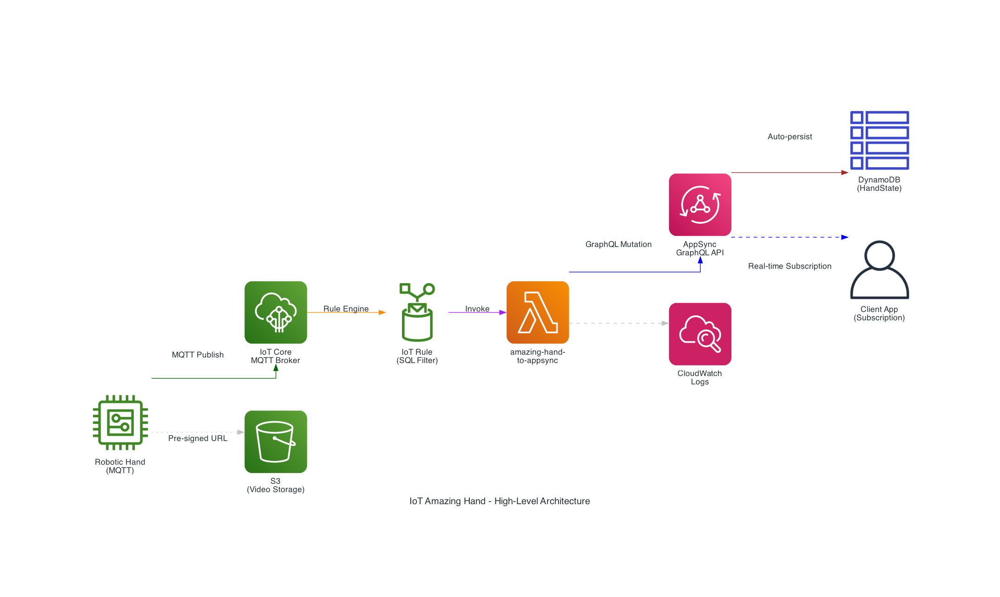
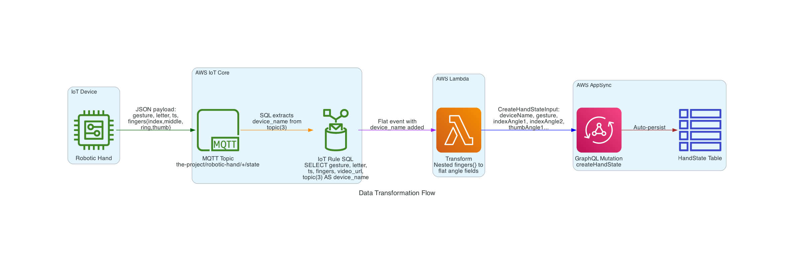
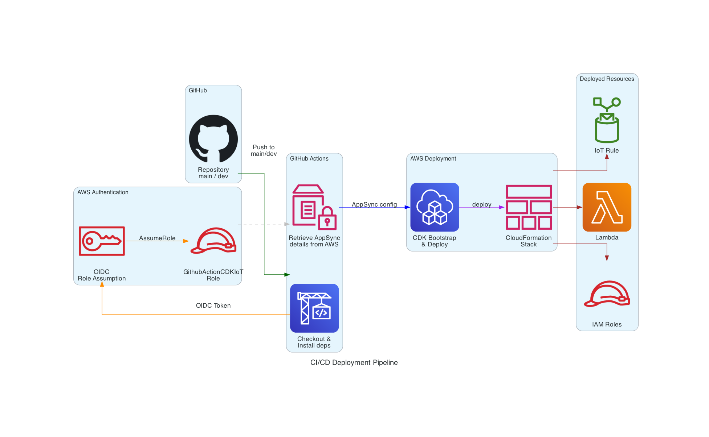

# IoT Amazing Hand Streaming

An AWS CDK infrastructure stack that streams real-time robotic hand state data from AWS IoT Core to AWS AppSync via Lambda, enabling clients to receive live hand gesture and finger position updates through GraphQL subscriptions.

## Architecture



A robotic hand device publishes its state (gesture, finger angles, letter) over MQTT to AWS IoT Core. An IoT Rule filters and routes the message to a Lambda function, which transforms the nested payload into a flat GraphQL mutation and sends it to AppSync. AppSync automatically persists the data to DynamoDB and pushes real-time updates to subscribed clients.

## How It Works



### Step-by-Step Data Flow

1. **MQTT Publish** — The robotic hand publishes a JSON payload to the MQTT topic:
   ```
   the-project/robotic-hand/{deviceName}/state
   ```

2. **IoT Rule SQL** — The IoT Rules Engine matches the topic pattern `the-project/robotic-hand/+/state` and executes:
   ```sql
   SELECT gesture, letter, ts, fingers, video_url, topic(3) AS device_name
   FROM 'the-project/robotic-hand/+/state'
   ```
   This extracts `device_name` from position 3 of the MQTT topic (e.g., `XIAOAmazingHandRight`) and passes the full `fingers` object as a nested structure.

3. **Lambda Transform** — The Lambda function receives the IoT Rule output and transforms the nested `fingers` object into flat AppSync fields:
   - `fingers.index.angle_1` → `indexAngle1`
   - `fingers.index.angle_2` → `indexAngle2`
   - `fingers.middle.angle_1` → `middleAngle1`
   - etc.

4. **GraphQL Mutation** — The Lambda calls the `createHandState` mutation on AppSync using the AWS Amplify SDK v6 with API Key authentication.

5. **DynamoDB Persist** — AppSync automatically persists the mutation result to a DynamoDB `HandState` table (managed by AppSync/Amplify, not this CDK stack).

6. **Real-time Subscription** — Client applications subscribe to AppSync GraphQL subscriptions to receive live hand state updates.

## Project Structure

```
cdk-iot-amazing-hand-streaming/
├── bin/
│   └── app.ts                          # CDK app entry point
├── lib/
│   └── iot-streaming-stack.ts          # CDK stack definition
├── lambda/
│   └── amazing-hand-to-appsync/
│       ├── index.js                    # Lambda handler
│       └── package.json                # Lambda dependencies (aws-amplify v6)
├── .github/
│   └── workflows/
│       └── aws-cdk-deploy.yml          # CI/CD pipeline
├── docs/
│   └── diagrams/                       # Architecture diagrams
├── deploy.sh                           # Local deployment script
├── cdk.json                            # CDK configuration
├── package.json                        # CDK dependencies
└── tsconfig.json                       # TypeScript configuration
```

## AWS Services

| Service | Role | Resource Name |
|---|---|---|
| AWS IoT Core | MQTT broker for device messages | Topic: `the-project/robotic-hand/+/state` |
| AWS IoT Rules Engine | Filters and routes MQTT messages | `AmazingHandStateStreamingRule` |
| AWS Lambda | Transforms payload, calls AppSync | `AmazingHandToAppSyncFunction` |
| AWS AppSync | GraphQL API with real-time subscriptions | External (Amplify-managed) |
| Amazon DynamoDB | Stores hand state records | `HandState` table (Amplify-managed) |
| Amazon S3 | Video storage (pre-signed URLs) | External |
| Amazon CloudWatch | Lambda execution logs | Auto-created log group |
| AWS IAM | Lambda execution role, IoT invoke permission | Auto-created by CDK |

## MQTT Topic & Payload Schema

### Topic Pattern

```
the-project/robotic-hand/+/state
```

The `+` wildcard matches any device name (e.g., `XIAOAmazingHandRight`).

### Payload Example

```json
{
  "gesture": "fingerspell",
  "letter": "E",
  "ts": 1770550850,
  "fingers": {
    "index": { "angle_1": 45, "angle_2": -45 },
    "middle": { "angle_1": 45, "angle_2": -45 },
    "ring": { "angle_1": 45, "angle_2": -45 },
    "thumb": { "angle_1": 60, "angle_2": -60 }
  },
  "video_url": "https://cc-amazing-video.s3.amazonaws.com/videos/hand_20260228.mp4?..."
}
```

| Field | Type | Description |
|---|---|---|
| `gesture` | String | Gesture classification (e.g., `"fingerspell"`) |
| `letter` | String | Recognized letter for fingerspelling |
| `ts` | Integer | Unix timestamp (seconds) |
| `fingers` | Object | Nested finger angle data |
| `fingers.{finger}.angle_1` | Integer | First joint angle for each finger |
| `fingers.{finger}.angle_2` | Integer | Second joint angle for each finger |
| `video_url` | String | Optional pre-signed S3 URL for video capture |

## IoT Rule SQL

```sql
SELECT gesture, letter, ts, fingers, video_url, topic(3) AS device_name
FROM 'the-project/robotic-hand/+/state'
```

- **`topic(3)`** — Extracts the device name from the 3rd segment of the MQTT topic
- **`fingers`** — Preserves the nested JSON structure `{index: {angle_1, angle_2}, ...}`
- **`video_url`** — Optional field, passed through when present
- **SQL version**: `2016-03-23`

## Lambda Function

**Runtime:** Node.js 18.x
**Timeout:** 30 seconds
**SDK:** AWS Amplify v6 (`aws-amplify@^6.0.0`)
**Auth mode:** API Key

### Environment Variables

| Variable | Description |
|---|---|
| `APPSYNC_API_URL` | AppSync GraphQL endpoint URL |
| `APPSYNC_API_KEY` | AppSync API key for authentication |
| `APPSYNC_API_ID` | AppSync API ID (used for IAM policy scoping) |

### GraphQL Mutation

```graphql
mutation CreateHandState($input: CreateHandStateInput!) {
  createHandState(input: $input) {
    id
    deviceName
    gesture
    letter
    indexAngle1
    indexAngle2
    middleAngle1
    middleAngle2
    ringAngle1
    ringAngle2
    thumbAngle1
    thumbAngle2
    timestamp
    videoUrl
    createdAt
  }
}
```

## Data Field Mapping

| IoT Payload Field | AppSync Field | Type | Default |
|---|---|---|---|
| `device_name` (from `topic(3)`) | `deviceName` | String | *(required)* |
| `gesture` | `gesture` | String | `null` |
| `letter` | `letter` | String | `null` |
| `fingers.index.angle_1` | `indexAngle1` | Int | `0` |
| `fingers.index.angle_2` | `indexAngle2` | Int | `0` |
| `fingers.middle.angle_1` | `middleAngle1` | Int | `0` |
| `fingers.middle.angle_2` | `middleAngle2` | Int | `0` |
| `fingers.ring.angle_1` | `ringAngle1` | Int | `0` |
| `fingers.ring.angle_2` | `ringAngle2` | Int | `0` |
| `fingers.thumb.angle_1` | `thumbAngle1` | Int | `0` |
| `fingers.thumb.angle_2` | `thumbAngle2` | Int | `0` |
| `ts` | `timestamp` | AWSTimestamp | `Date.now() / 1000` |
| `video_url` | `videoUrl` | String | `null` |

## AppSync GraphQL Schema

The Lambda expects the following schema on the AppSync API (managed externally by Amplify):

```graphql
input CreateHandStateInput {
  deviceName: String!
  gesture: String
  letter: String
  indexAngle1: Int
  indexAngle2: Int
  middleAngle1: Int
  middleAngle2: Int
  ringAngle1: Int
  ringAngle2: Int
  thumbAngle1: Int
  thumbAngle2: Int
  timestamp: AWSTimestamp
  videoUrl: String
}

type HandState @model {
  id: ID!
  deviceName: String!
  gesture: String
  letter: String
  indexAngle1: Int
  indexAngle2: Int
  middleAngle1: Int
  middleAngle2: Int
  ringAngle1: Int
  ringAngle2: Int
  thumbAngle1: Int
  thumbAngle2: Int
  timestamp: AWSTimestamp
  videoUrl: String
  createdAt: AWSDateTime
}

type Mutation {
  createHandState(input: CreateHandStateInput!): HandState
}

type Subscription {
  onCreateHandState: HandState @aws_subscribe(mutations: ["createHandState"])
}
```

## CDK Stack

### Stack: `IoTAmazingHandStreamingStack`

**Resources created:**

| Resource | CDK Construct | Description |
|---|---|---|
| Lambda Function | `aws-cdk-lib/aws-lambda.Function` | Transforms IoT payload and calls AppSync |
| IoT Topic Rule | `aws-cdk-lib/aws-iot.CfnTopicRule` | Routes MQTT messages to Lambda |
| IAM Policy | `aws-cdk-lib/aws-iam.PolicyStatement` | Grants Lambda `appsync:GraphQL` access |
| Lambda Permission | `Function.addPermission` | Allows IoT service to invoke Lambda |

**Stack Props:**

```typescript
interface IoTStreamingStackProps extends cdk.StackProps {
  appSyncApiUrl: string;   // AppSync GraphQL endpoint URL
  appSyncApiKey: string;   // AppSync API key
  appSyncApiId: string;    // AppSync API ID (for IAM resource scoping)
}
```

**Stack Outputs:**

| Output | Description |
|---|---|
| `AmazingHandIoTRuleArn` | ARN of the IoT Topic Rule |
| `AmazingHandLambdaFunctionArn` | ARN of the Lambda function |

## Deployment

### Prerequisites

- Node.js 18+
- AWS CDK CLI (`npm install -g aws-cdk`)
- AWS credentials configured
- An existing AppSync API with the `HandState` schema (see [AppSync GraphQL Schema](#appsync-graphql-schema))

### Local Deployment

Set the required environment variables and run the deploy script:

```bash
export APPSYNC_API_ID=your_api_id
export APPSYNC_API_URL=https://your-api-id.appsync-api.us-east-1.amazonaws.com/graphql
export APPSYNC_API_KEY=your_api_key

./deploy.sh
```

The script will:
1. Validate environment variables
2. Install CDK and project dependencies
3. Install Lambda dependencies
4. Bootstrap CDK (if needed)
5. Deploy the stack

### CI/CD via GitHub Actions



The pipeline triggers on pushes to `main` and `dev` branches.

**How it works:**

1. **Checkout & Install** — Checks out the repo, installs Node.js 18, CDK CLI, and all dependencies
2. **OIDC Authentication** — Uses GitHub's OIDC token to assume the `GithubActionCDKIoT` IAM role (no static credentials)
3. **Retrieve AppSync Config** — Dynamically fetches AppSync API details from AWS:
   - Reads Amplify App ID from SSM Parameter Store (`/iot/amplify/iot`)
   - Finds the Amplify data CloudFormation stack
   - Extracts the AppSync API ID, URL, and API key
4. **CDK Deploy** — Bootstraps and deploys the stack with `--require-approval never`

**Branch-based secrets:** The workflow maps branches to secret suffixes (`main` → `PROD`, `dev` → `DEV`) for the AWS Account ID, enabling multi-environment deployments.

### Environment Variables Reference

| Variable | Source | Description |
|---|---|---|
| `APPSYNC_API_URL` | Manual / CI auto-fetched | AppSync GraphQL endpoint |
| `APPSYNC_API_KEY` | Manual / CI auto-fetched | AppSync API key |
| `APPSYNC_API_ID` | Manual / CI auto-fetched | AppSync API ID |
| `CDK_DEFAULT_ACCOUNT` | AWS credentials | AWS account for deployment |
| `CDK_DEFAULT_REGION` | AWS credentials | AWS region (defaults to `us-east-1`) |

## Configuration

AppSync connection details can be provided via CDK context or environment variables. The CDK app checks both, with context taking precedence:

```typescript
// bin/app.ts
const appSyncApiUrl = app.node.tryGetContext('appSyncApiUrl') || process.env.APPSYNC_API_URL;
const appSyncApiKey = app.node.tryGetContext('appSyncApiKey') || process.env.APPSYNC_API_KEY;
const appSyncApiId = app.node.tryGetContext('appSyncApiId') || process.env.APPSYNC_API_ID;
```

**Using CDK context (alternative to env vars):**

```bash
cdk deploy -c appSyncApiUrl=https://... -c appSyncApiKey=... -c appSyncApiId=...
```
